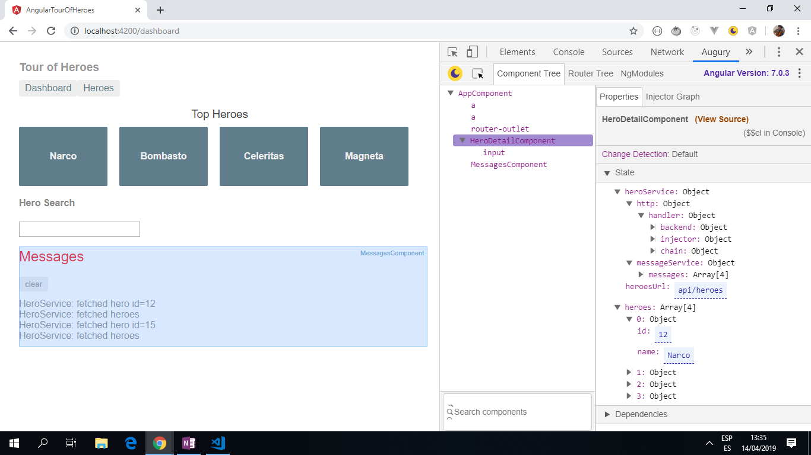

# :zap: Angular Tour of Heroes

* This is a data-driven app that stores and displays a list of heroes, edits their details and allows navigation of the data using different views.
* Tutorial code from [Angular](https://angular.io) - see [:clap: Inspiration](#clap-inspiration) below.
* **Note:** to open web links in a new window use: _ctrl+click on link_


## :page_facing_up: Table of contents

* [:zap: Angular Tour of Heroes](#zap-angular-tour-of-heroes)
  * [:page_facing_up: Table of contents](#page_facing_up-table-of-contents)
  * [:books: General info](#books-general-info)
  * [:camera: Screenshots](#camera-screenshots)
  * [:signal_strength: Technologies](#signal_strength-technologies)
  * [:floppy_disk: Setup](#floppy_disk-setup)
  * [:computer: Code Examples](#computer-code-examples)
  * [:cool: Features](#cool-features)
  * [:clipboard: Status & To-Do List](#clipboard-status--to-do-list)
  * [:clap: Inspiration](#clap-inspiration)
  * [:file_folder: License](#file_folder-license)
  * [:envelope: Contact](#envelope-contact)

## :books: General info

* This app does the following:

1. Uses built-in Angular directives to show and hide elements and display lists of hero data.
2. Creates Angular components to display hero details and show an array of heroes.
3. Uses one-way data binding for read-only data.
4. Adds editable fields to update a model with two-way data binding.
5. Binds component methods to user events, like keystrokes and clicks.
6. Enables users to select a hero from a master list and edit that hero in the details view.
7. Formats data with pipes.
8. Creates a shared service to assemble the heroes.
9. Uses routing to navigate among different views and their components.

## :camera: Screenshots

.

## :signal_strength: Technologies

* [Angular v12](https://angular.io/)
* [In-memory-web-api](https://www.npmjs.com/package/angular-in-memory-web-api) for Angular demos and tests that emulate CRUD operations over a REST API. For dev only.
* [Reactive Extensions for Javascript -RxJS](https://angular.io/guide/rx-library) library used for reactive programming using the observable type.

## :floppy_disk: Setup

* Run `ng serve` for a dev server.
* Navigate to `http://localhost:4200/`. The app will automatically reload if you change any of the source files.
* Run `ng lint` to run TSLint (note - indent and use of commas made false in tslint.json). Currently passing.

## :computer: Code Examples

* _in-memory-data-service_ file

```typescript
// Angular in-memory web api module
// This provides the InMemoryDataService as a parameter for the .forRoot method of the InMemoryServiceiModule module.
// Overrides the createDb() method.

import { InMemoryDbService } from 'angular-in-memory-web-api';
import { Hero } from './hero';
import { Injectable } from '@angular/core';

@Injectable({
  providedIn: 'root',
})
export class InMemoryDataService implements InMemoryDbService {
  createDb() {
    const heroes = [
      { id: 11, name: 'Mr. Nice' },
      { id: 12, name: 'Narco' },
      { id: 13, name: 'Bombasto' },
      { id: 14, name: 'Celeritas' },
      { id: 15, name: 'Magneta' },
      { id: 16, name: 'RubberMan' },
      { id: 17, name: 'Dynama' },
      { id: 18, name: 'Dr IQ' },
      { id: 19, name: 'Magma' },
      { id: 20, name: 'Tornado' }
    ];
    return {heroes};
  }

  // Overrides the genId method to ensure that a hero always has an id.
  // If the heroes array is empty,
  // the method below returns the initial number (11).
  // if the heroes array is not empty, the method below returns the highest
  // hero id + 1.
  genId(heroes: Hero[]): number {
    return heroes.length > 0 ? Math.max(...heroes.map(hero => hero.id)) + 1 : 11;
  }

  constructor() { }
}
```

## :cool: Features

* CRUD operations: heroes can be created, read, updated (name only) and deleted from a 'My Heroes' list.
* Clicking on a hero routes to a hero details page.
* A 'Messages' list records fetching and deleting of heroes from the My Heroes list.

## :clipboard: Status & To-Do List

* Status: Working app with in-memory database storage of heroes.
* To-Do: add theme colors and functionality.

## :clap: Inspiration

* [Angular Tutorial: Tour of Heroes](https://angular.io/tutorial).
* [Techie Diaries´s Angular In-Memory Web API Tutorial](https://www.techiediaries.com/angular-inmemory-web-api/)

## :file_folder: License

* This project is licensed under the terms of the MIT license.

## :envelope: Contact

* Repo created by [ABateman](https://github.com/AndrewJBateman), email: gomezbateman@yahoo.com
